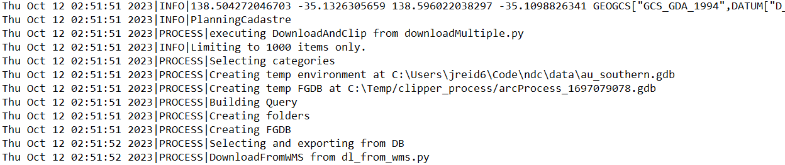

# Introduction 
A custom logger class for use with GIS projects. Because the ESRI logging inteferes with Pythons logging.
* Clogger allows you to use very basic categories (info, data, process, warning, error) for your log messages.
* Clogger uses pipes | so you can import the log into excel adn filter if required.



# Getting Started

Copy clogger.py into any project you want to work with, create a new object and parse what you need to it

# Logging Methods

- Info Clogger.info(log_item)
- Data Clogger.data(log_item)
- Process Clogger.process(log_item)
- Warning Clogger.warning(log_item)
- Error Clogger.error(log_item)
- Shut Down Logger Clogger.shut_down_clogger()

## Import the logger

`import clogger as ...`

## Create an instance of the logger to use in your code

`log_me = custom_log.ClipperLog(r"C:full path to output directory ie C:\My Documents")`

## Log some info
```
log_me.info(f"clipper executed by {environ.get('USERNAME')}")
log_me.info(region_name)
log_me.info(regional_info)
log_me.info(parameters[3].valueAsText)
  ```

## Log an error
`log_me.error("Whatever your error message is")`

## Don't forget to close the logger!

```
log_me.info("=========TASK COMPLETE=========")
log_me.shut_down_logger()
```

# Contribute

Clone away :)

# Issue?

Holler JayArghArgh.